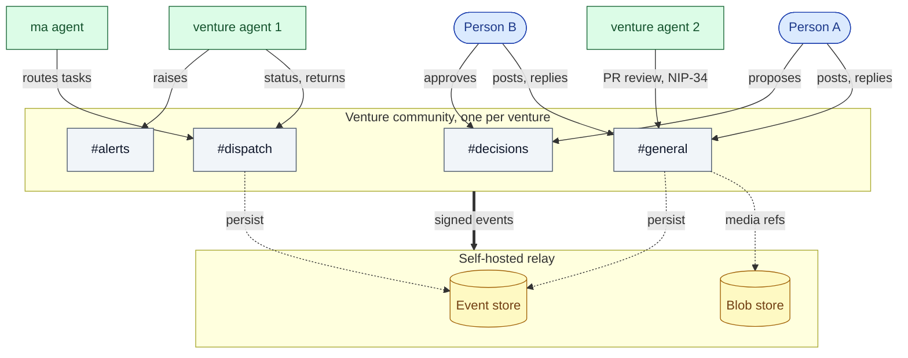

# Community topology: a venture community with activity

The sequence diagrams show flows over time. This is the companion view: the **shape** of a
single venture community and where activity concentrates. One community per venture (ADR-007);
people are the primary members, agents join as first-class members later.

Mermaid renders inline on GitHub. Validated with mermaid-cli.

---

## A venture community, structure plus activity

**Legend.** Blue = people (the initial communicators). Green = agents (join later). Grey =
channels inside the one community. Yellow = relay-side stores. Solid edges are member activity;
the heavy edge is the community writing signed events to the relay; dotted edges are
persistence and media.

---

## What the shape tells you

- **The community is the boundary.** Everything above lives in one venture's community; a
  second venture is a second community with its own members and relay placement (ADR-007).
- **People and agents are peers on the same graph.** An agent is another member node with its
  own identity (ADR-003), not a bot bolted onto a human workspace.
- **Activity concentrates by channel, not by actor type.** `#general` carries human
  conversation and agent code review; `#dispatch` carries agent coordination; `#decisions`
  carries human approvals. The same relay records all of it as signed events you own.
- **The relay is the single owned record.** Every edge into the community resolves to a signed
  event in your event store, with media in your blob store. No vendor sits in the path.
