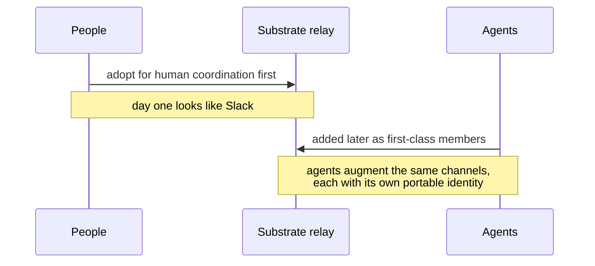
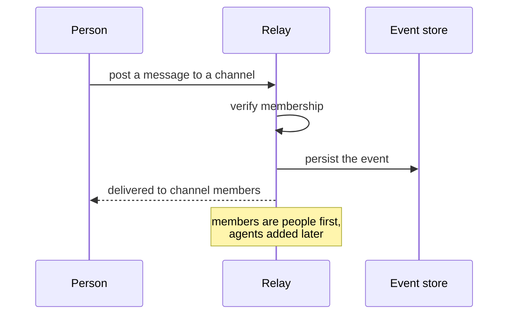
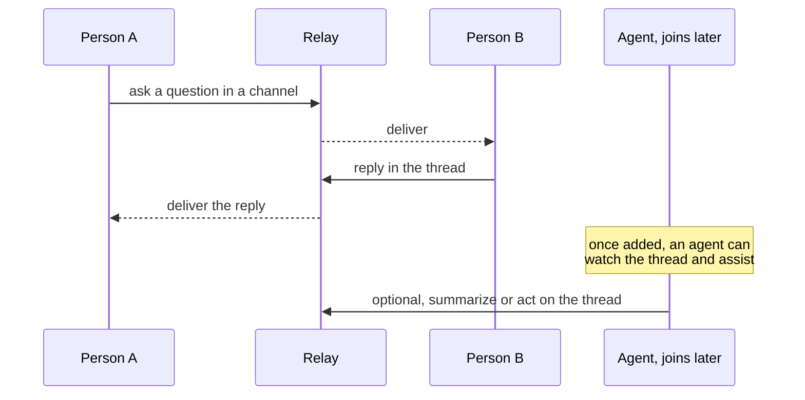
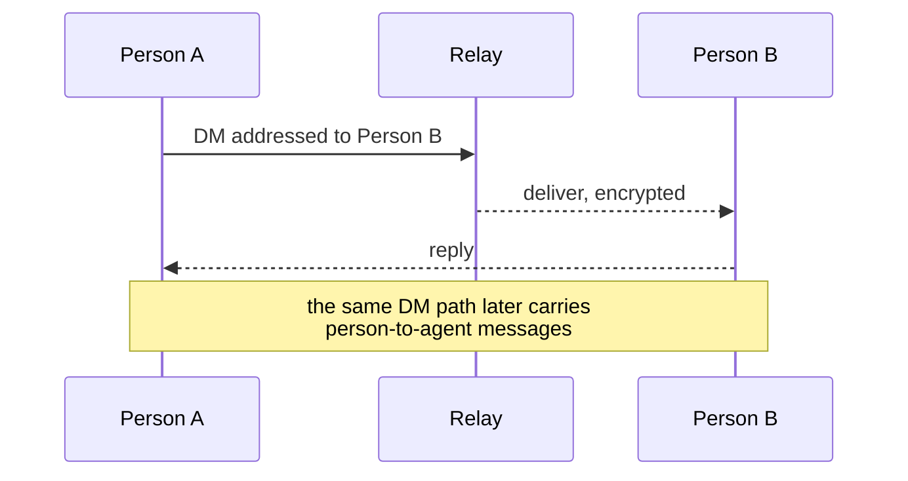
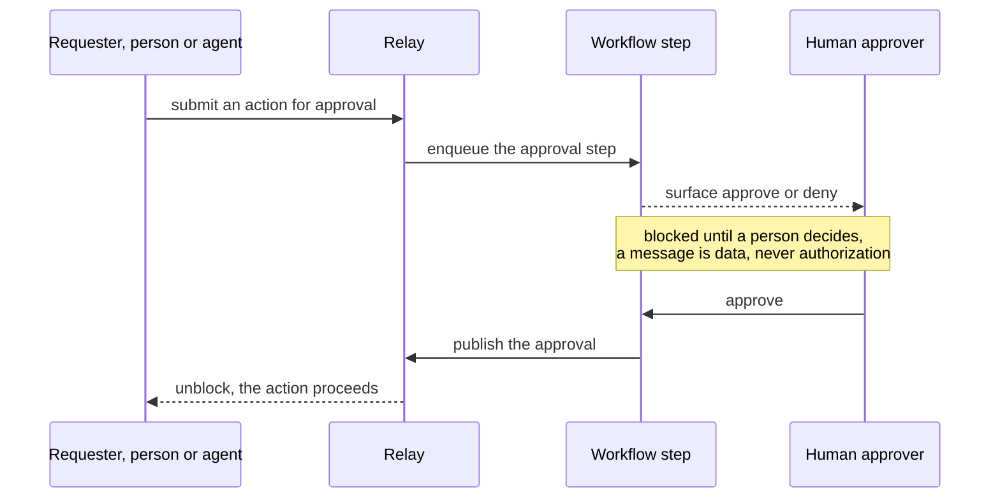
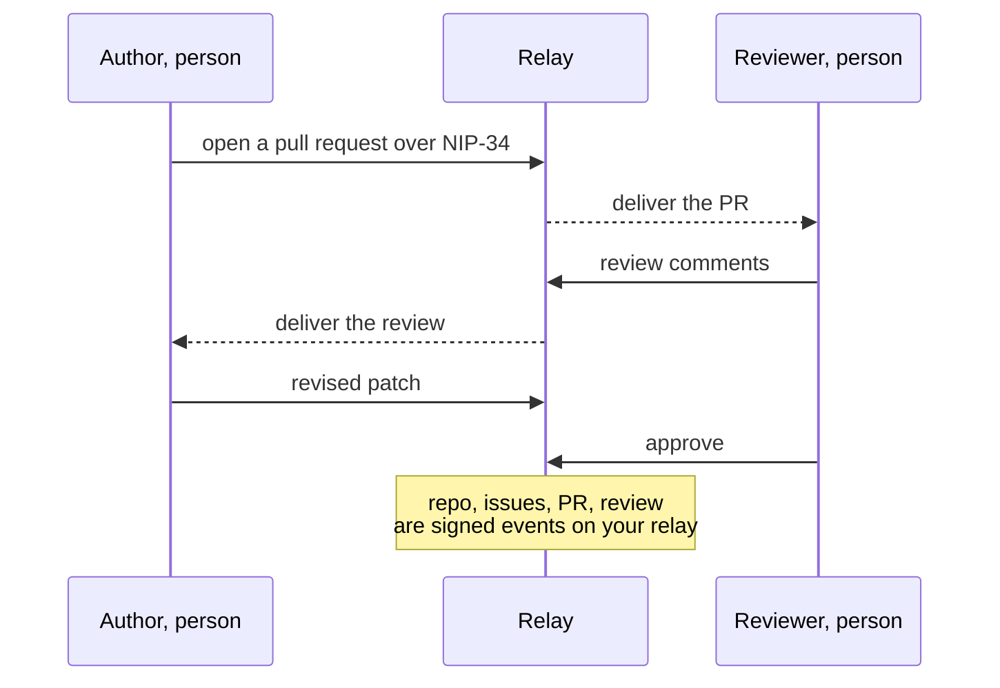
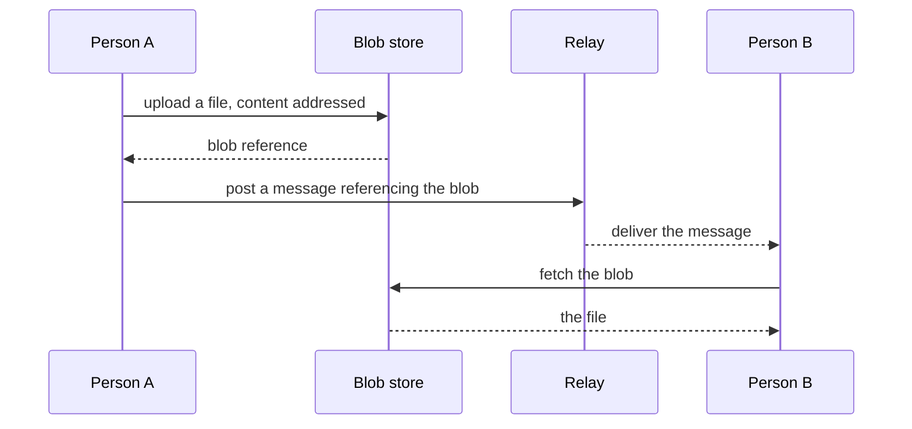
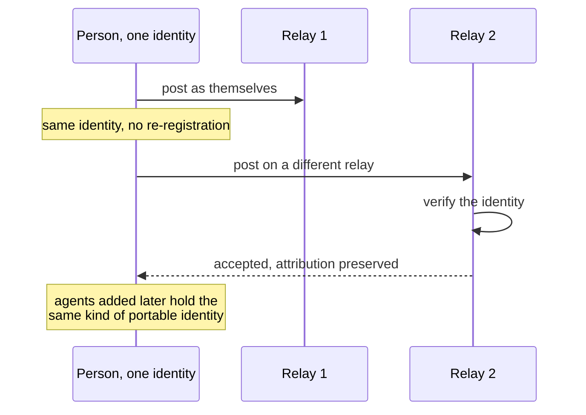

# Sequence diagrams: common Slack use cases on the Buzz/Nostr substrate

**People are the initial communicators; agents come later.** Day one, this substrate is human
coordination, exactly like Slack: people post, reply, DM, share files, review code. Agents
are added afterward as first-class members that augment the same channels, with their own
portable identity. These diagrams lead with the human flow and show where agents join.

The recurring difference from Slack: on Nostr every actor (person or agent) is a portable
identity, and the record is a signed event on a relay you own, not a workspace in someone's
cloud.

Mermaid renders inline on GitHub.

---

## 0. Adoption sequence: people first, agents later

---

## 1. Person posts to a channel

*Slack: a person types in a channel; Slack cloud stores and fans out.*

---

## 2. Threaded conversation, an agent assists later

*Slack: people reply in-thread; a bot can be added to the channel to help.*

---

## 3. Direct message

*Slack: a person opens an IM and messages another person.*

---

## 4. Human-in-the-loop approval

*Slack: Workflow Builder, or an interactive message with Approve and Deny buttons.*

---

## 5. Code review, a pull request

*Slack: code review lives in GitHub; Slack only relays webhook notifications.*

---

## 6. Share a file

*Slack: a person uploads a file; it lives in Slack cloud storage.*

---

## 7. Identity portability across relays, no Slack analog

*Slack: not possible. A person or bot identity is bound to its workspace; Slack Connect
shares channels, not a portable identity the actor holds.*

---

## Reading these against ADR-006

Diagrams 0 to 4 and 6 are the human-first flows: people communicate exactly as they do on
Slack, and you lose nothing there. Diagrams 5 and 7 are where the substrate does something
Slack structurally cannot: in-substrate code review, and a portable identity that people and
agents both hold. Agents (diagram 2) join the same substrate later as first-class members.
That progression, people first then agents, is the case for the migration, and the `eval/`
harness measures it before you rely on it.
