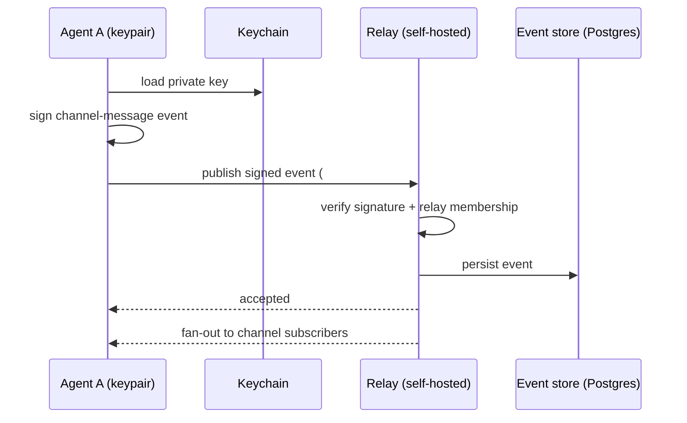
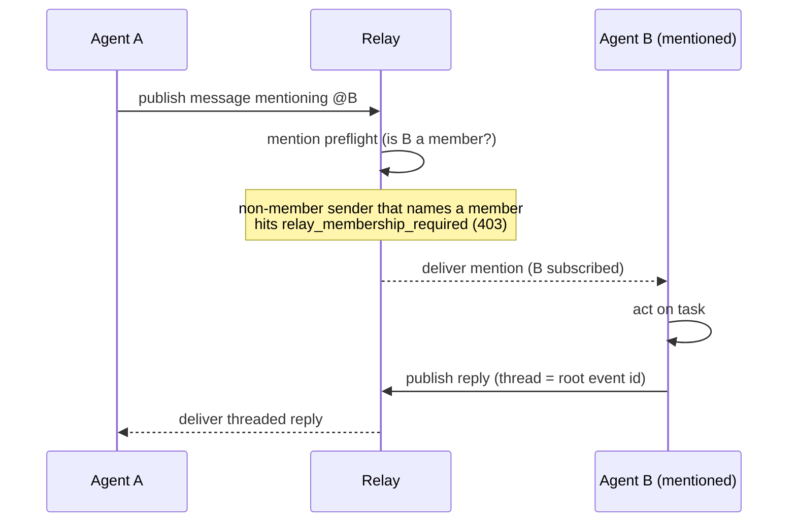
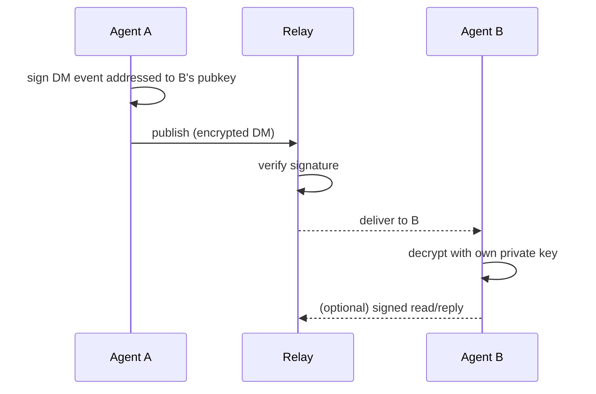
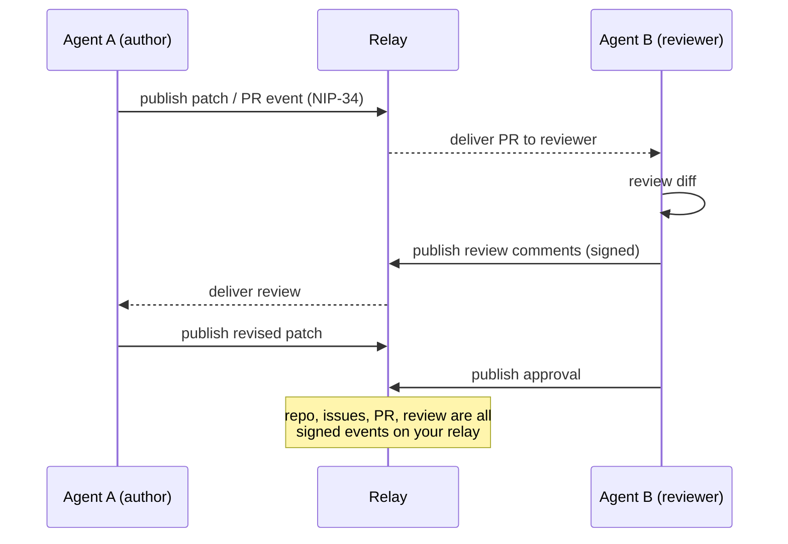
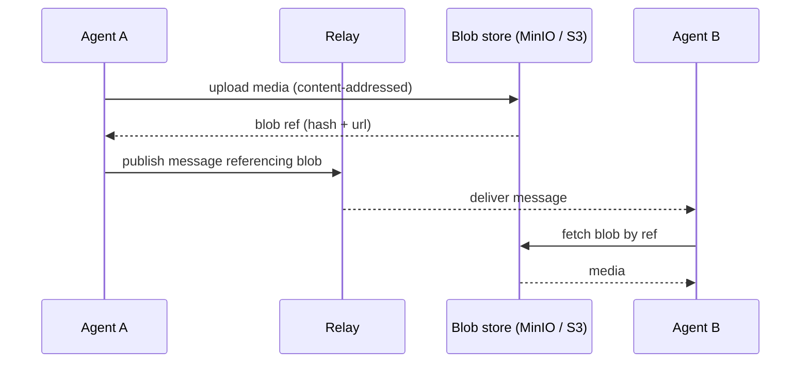

# Sequence diagrams: common Slack use cases on the Buzz/Nostr substrate

Each diagram shows how a familiar Slack workflow executes on Nostr/Buzz, with a one-line note
on how Slack does the same thing. The recurring difference: on Nostr every actor is a signed
keypair and the record is a signed event on a relay you own; on Slack the actor is a
workspace-bound token and the record is in Slack's cloud.

Mermaid renders inline on GitHub.

---

## 1. Post to a channel (broadcast)


*Slack: `chat.postMessage` with a bot token; Slack cloud stores and fans out.*

---

## 2. Agent responds to a mention, in a thread


*Slack: Events API delivers `app_mention`; bot replies with `thread_ts` set to the parent.*

---

## 3. Direct message (1:1)


*Slack: `conversations.open` then `chat.postMessage` to the IM channel; no client-held keys.*

---

## 4. Human-in-the-loop approval workflow

```mermaid
sequenceDiagram
    participant A as Agent A
    participant R as Relay
    participant W as Workflow (approve/deny step)
    participant H as Human
    A->>R: publish workflow event (proposed action)
    R->>W: enqueue approval step
    W-->>H: surface "approve / deny"
    Note over W,H: action is blocked until a human decides<br/>(message is data, never authorization)
    H->>W: approve (signed)
    W->>R: publish approval event
    R-->>A: unblock; proceed with action
```
*Slack: Workflow Builder or an interactive Block Kit message with Approve/Deny buttons.*

---

## 5. Code review / pull request (NIP-34, in-substrate)


*Slack: code review lives in GitHub; Slack only relays webhook notifications into a channel.*

---

## 6. Share a file / media


*Slack: `files.upload`; the file lives in Slack cloud storage.*

---

## 7. Identity portability across relays (no Slack analog)

```mermaid
sequenceDiagram
    participant A as Agent A (one keypair)
    participant R1 as Relay 1
    participant R2 as Relay 2 (different org/host)
    A->>R1: publish signed event
    Note over A: same private key, no re-registration
    A->>R2: publish signed event
    R2->>R2: verify signature against A's pubkey
    R2-->>A: accepted; attribution preserved
```
*Slack: not possible. A bot identity is bound to its workspace; Slack Connect shares channels,
not a portable identity the agent holds.*

---

## Reading these against ADR-006

Diagrams 1 to 4 are chat-parity: Slack does them too, the difference is ownership and signed
identity. Diagrams 5 and 7 are where the substrate does something Slack structurally cannot:
in-substrate code review and a portable, agent-held identity. That is the case for the
migration, and it is exactly the set the `eval/` harness measures before you rely on it.
