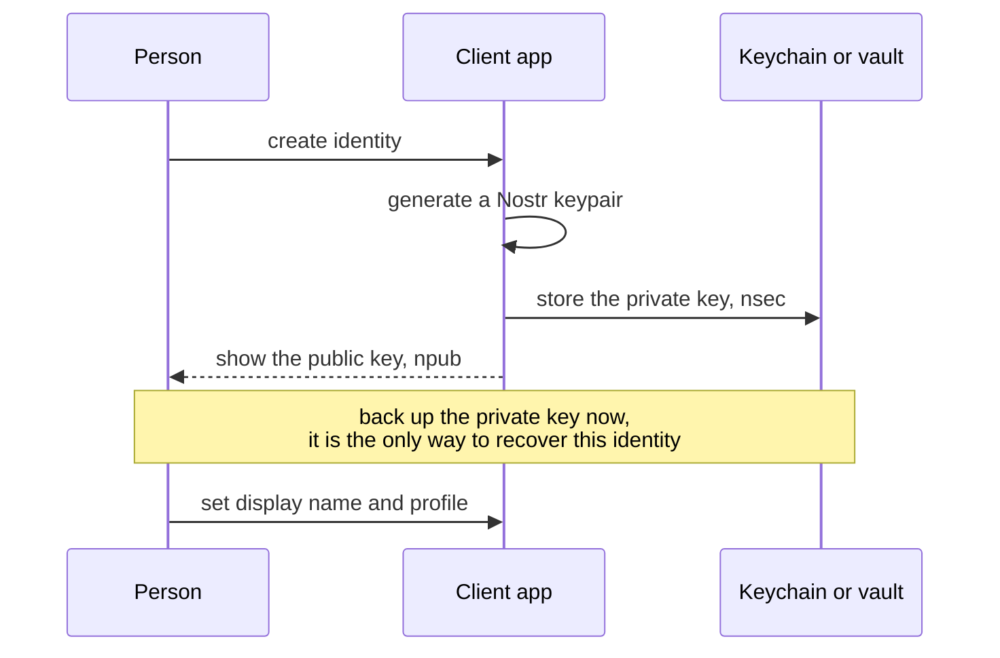
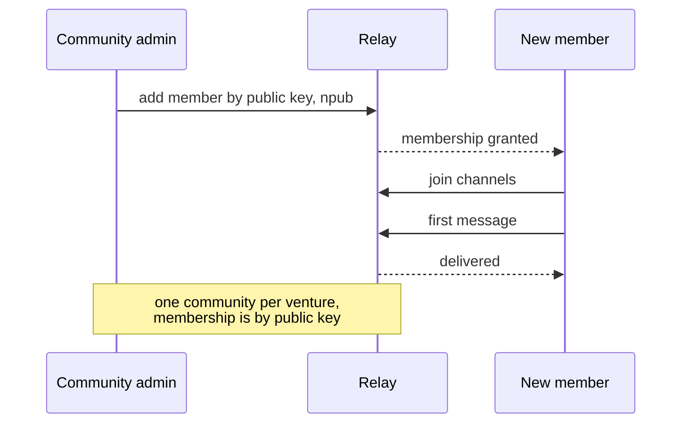
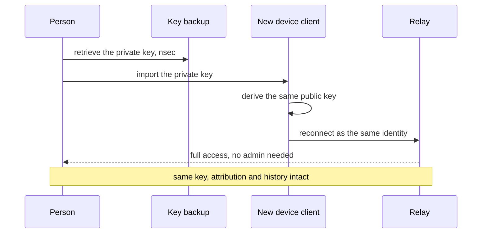
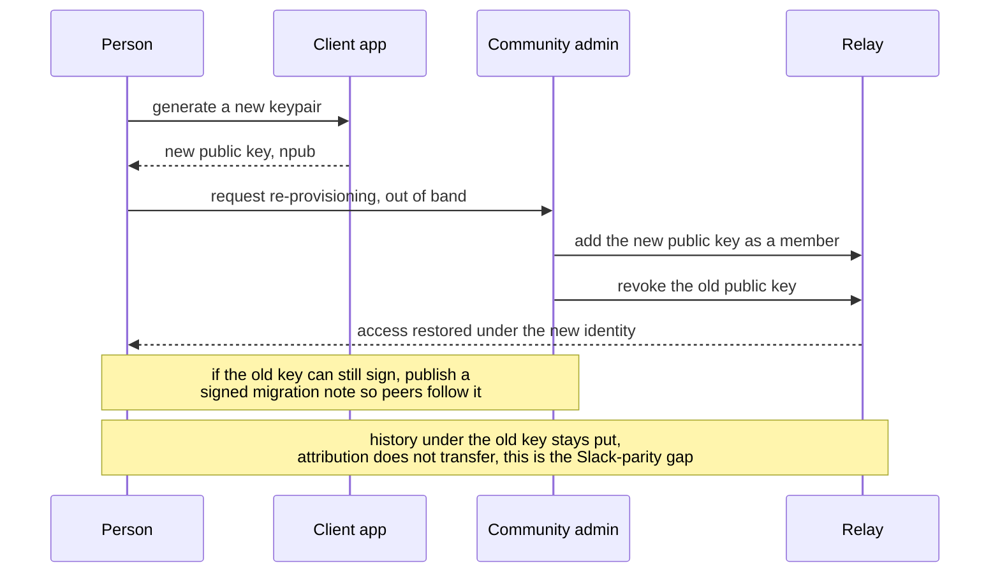

# User lifecycle: setup, onboarding, account recovery

People are the initial communicators (see `sequence-diagrams.md`), so their lifecycle on the
substrate matters as much as messaging. Three flows: first-time **setup** (create an
identity), **onboarding** (join a venture community), and **account recovery** (the honest
hard edge, because identity is a key you hold, not a password someone can reset).

Decision record for the recovery model: [`adrs/008-identity-lifecycle-and-recovery.md`](adrs/008-identity-lifecycle-and-recovery.md).

Mermaid renders inline on GitHub. All diagrams validated with mermaid-cli.

---

## 1. Setup, first-time identity

*Slack: sign up with email plus a password the provider can reset. Here you hold the key, so
the backup step at setup is not optional.*

---

## 2. Onboarding, join a venture community

*Slack: an admin invites an email into the workspace. Here membership is granted to a public
key, and one community equals one venture (ADR-007).*

---

## 3. Account recovery, you have a backup

*Slack: reset a password. Here, restoring the backed-up key fully recovers the identity with
no admin involved.*

---

## 4. Account recovery, key lost or compromised

*Slack: the provider resets the account and history follows. Here, a lost key cannot be
regenerated: the community admin is the trust anchor that re-provisions membership to a new
key. This is the honest cost of holding your own identity (ADR-003, ADR-008).*

---

## The tradeoff, stated plainly

| | Slack | Substrate |
|--|--|--|
| Who holds identity | provider | the person (a keypair) |
| Recovery with backup | password reset | import the key, history intact |
| Recovery without backup | provider resets account | admin re-provisions a new key; old-key attribution does not transfer |
| Trust anchor | the provider | the person's backup, then the community admin |

The upside (own your identity, portable across relays) and the downside (recovery is your
backup discipline plus admin re-provisioning) are the same coin. ADR-008 makes the backup
step mandatory at setup precisely to keep flow 3 the common case and flow 4 the rare one.
